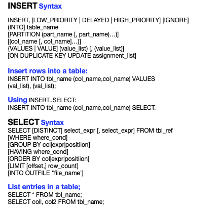

# Insert, View, and  Delete Data.



Let's insert some values into the table.
We start by logging in to [MySQL](http://www.mysql.com) server.

```bash
# mysql -u root -p 
Enter password:

mysql>
```

Let's change to _"prod"_ database and use _customers_ table and we also
need to _describe_ the table:

```
mysql> USE prod;
Database changed

mysql> SHOW TABLES;
+----------------+
| Tables_in_prod |
+----------------+
| customers      |
+----------------+
1 row in set (0.00 sec)

mysql> DESCRIBE customers;
+--------------+-------------+------+-----+---------+----------------+
| Field        | Type        | Null | Key | Default | Extra          |
+--------------+-------------+------+-----+---------+----------------+
| cust_id      | int         | NO   | PRI | NULL    | auto_increment |
| username     | varchar(50) | YES  |     | NULL    |                |
| first_name   | varchar(50) | YES  |     | NULL    |                |
| last_name    | varchar(50) | YES  |     | NULL    |                |
| phone_number | varchar(25) | YES  |     | NULL    |                |
+--------------+-------------+------+-----+---------+----------------+
5 rows in set (0.00 sec)

```
Now, we are going to insert some values in two different ways.
1. One row at a time.
2. Two rows at a time.

```
mysql> 
mysql> INSERT INTO customers (username, first_name, last_name, phone_number) VALUES 
('bwayne','bruce','wayne','2222222222');
Query OK, 1 row affected (0.01 sec)

mysql> INSERT INTO customers (username, first_name, last_name, phone_number) VALUES 
('pparker','peter','parker','3333333333'),  ('tstark','tony','stark','3333333333');
Query OK, 2 rows affected (0.01 sec)
Records: 2  Duplicates: 0  Warnings: 0
```
Inserting values from one table to another.

```
mysql> INSERT INTO customers_test (cust_id,username,first_name,last_name,phone_number) SELECT * FROM custo
mers WHERE cust_id = '1';
Query OK, 1 row affected (0.00 sec)
Records: 1  Duplicates: 0  Warnings: 0

mysql> SELECT * FROM customers_test
    -> ;
+---------+----------+------------+-----------+--------------+
| cust_id | username | first_name | last_name | phone_number |
+---------+----------+------------+-----------+--------------+
|       1 | bwayne   | bruce      | wayne     | 2222222222   |
+---------+----------+------------+-----------+--------------+
1 row in set (0.00 sec)
```

Let's insert the rest of the columns into _customer_test_
```
mysql> INSERT INTO customers_test (cust_id,username,first_name,last_name,phone_number) SELECT * FROM customers WHERE cust_id > '1';
Query OK, 2 rows affected (0.00 sec)
Records: 2  Duplicates: 0  Warnings: 0

mysql> SELECT * FROM customers_test;
+---------+----------+------------+-----------+--------------+
| cust_id | username | first_name | last_name | phone_number |
+---------+----------+------------+-----------+--------------+
|       1 | bwayne   | bruce      | wayne     | 2222222222   |
|       2 | pparker  | peter      | parker    | 3333333333   |
|       3 | tstark   | tony       | stark     | 3333333333   |
+---------+----------+------------+-----------+--------------+
3 rows in set (0.00 sec)
```
Voilà! 

> **Note:** Keep in mind that _SELLECT_ statement has a lot of
fuctionality, we will see it in the following examples.

```
mysql> SELECT * FROM customers_test ORDER BY last_name;
+---------+----------+------------+-----------+--------------+
| cust_id | username | first_name | last_name | phone_number |
+---------+----------+------------+-----------+--------------+
|       2 | pparker  | peter      | parker    | 3333333333   |
|       3 | tstark   | tony       | stark     | 3333333333   |
|       1 | bwayne   | bruce      | wayne     | 2222222222   |
+---------+----------+------------+-----------+--------------+
3 rows in set (0.00 sec)

mysql> 
```

Select a couple of columns, as follows:
```
mysql> SELECT first_name, last_name FROM customers_test;
+------------+-----------+
| first_name | last_name |
+------------+-----------+
| bruce      | wayne     |
| peter      | parker    |
| tony       | stark     |
+------------+-----------+
3 rows in set (0.01 sec)

```

Let's concatenate the last columns, as follows;
```
mysql> SELECT CONCAT(last_name,', ',first_name) FROM customers_test;
+-----------------------------------+
| CONCAT(last_name,', ',first_name) |
+-----------------------------------+
| wayne, bruce                      |
| parker, peter                     |
| stark, tony                       |
+-----------------------------------+
3 rows in set (0.00 sec)
```

## DELETE **Systax**
---
DELETE FROM tabel_name [WHERE where_condition] [ORDER BY ...]
[LIMIT row_count]

### Delete record from a table:

DELETE FROM table_name WHERE column = 'value'

---

> **Note:** Be careful when using _DELETE_ statement, we have
to be very specific what we want to delete.

```
mysql> DELETE FROM customers_test WHERE first_name = 'bruce';
Query OK, 1 row affected (0.01 sec)

mysql> SELECT * FROM customers_test;
+---------+----------+------------+-----------+--------------+
| cust_id | username | first_name | last_name | phone_number |
+---------+----------+------------+-----------+--------------+
|       2 | pparker  | peter      | parker    | 3333333333   |
|       3 | tstark   | tony       | stark     | 3333333333   |
+---------+----------+------------+-----------+--------------+
2 rows in set (0.00 sec)
```

As we can see, one row was deleted and we are left with two records.
If we do not specify _WHERE_ statement then it deletes all the records.

```
mysql> DELETE FROM customers_test;
Query OK, 2 rows affected (0.01 sec)

mysql> SELECT * FROM customers_test;
Empty set (0.00 sec)

mysql> 
```

> Continue with [Constraints - MySQL](constrains.md) file ...