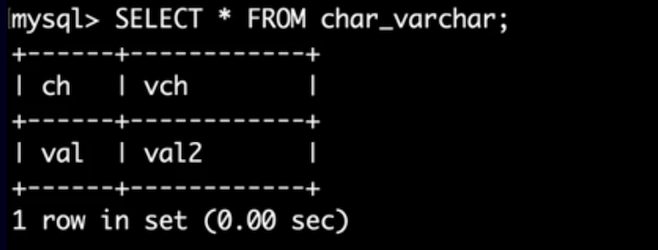

# String Types.

## CHAR vs VARCHAR Types.
The CHAR and VARCHAR types are similar, but differ in the way they are stored and retrieved. They also differ in maximum length and in whether trailing spaces are retained.
The CHAR and VARCHAR types are declared with a length that indicates the maximum number of characters you want to store. For example, CHAR(30) can hold up to 30 characters.

In contrast to CHAR, VARCHAR values are stored as a 1-byte or 2-byte length prefix plus data. The length prefix indicates the number of bytes in the value. A column uses one length byte if values require no more than 255 bytes, two length bytes if values may require more than 255 bytes.

### CHAR
The length of a CHAR column is fixed to the length that you declare when you create the table. The length can be any value from 0 to 255. When CHAR values are stored, they are right-padded with spaces to the specified length. When CHAR values are retrieved, trailing spaces are removed unless the PAD_CHAR_TO_FULL_LENGTH SQL mode is enabled.

### VARCHAR
Values in VARCHAR columns are variable-length strings. The length can be specified as a value from 0 to 65,535. The effective maximum length of a VARCHAR is subject to the maximum row size (65,535 bytes, which is shared among all columns) and the character set used.

The following table illustrates how _CHAR_ and _VARCHAR_ are stored.

> **NOTE:** [MySQL Documentation](https://dev.mysql.com/doc/refman/8.0/en/char.html)

|Value      |CHAR(4)        |Storage Required   |VARCHAR(4)     | Storage Required  |
|:---       |:---           |:---               |:---           |:---               |
|''         |'    '         |4 bytes            |''             |1 byte             |
|'ab'       |'ab  '         |4 bytes            |'ab'           |3 bytes            |
|'abcd'     |'abcd'         |4 bytes            |'abcd'         |5 bytes            |
|'abcdefgh' |'abcd'         |4 bytes            |'abcd'         |5 bytes            |

> **NOTE:** If a given value is stored into the CHAR(4) and VARCHAR(4) columns, the values retrieved from the columns are not always the same because trailing spaces are removed from CHAR columns upon retrieval.

Let's interact with the created table.

```
DESCRIBE var_varchar;

Field, Type, NULL, KEY, Default, Extra
'ch','char(25)','YES','',NULL,''
'vch','varchar(25)','YES','',NULL,''
```

Let's insert some date into the table's fields.

```
INSERT INTO char_varchar(ch, vch)
VALUES('val      ', 'val2      ');

SELECT * FROM char_varchar;

# ch	vch
val	val2      
```
> **NOTE:** ch variable does not retrieve spaces data that were entered in the values section.


The image shows the difference.



## TEXT
TEXT values are treated as nonbinary strings (character strings). They have a character set other than binary, and values are sorted and compared based on the collation of the character set.
The four TEXT types are TINYTEXT, TEXT, MEDIUMTEXT, and LONGTEXT. Truncation of excess trailing spaces from values to be inserted into TEXT columns always generates a warning, regardless of the SQL mode.

For _TEXT_ columns, you have to specify an index prefix length. For _CHAR_ and _VARCHAR_ a prefix length is optional.
_TEXT_ columns cannot have DEFAULT values. Because _TEXT_ values can be extremely long, you might encounter some constrains in using them.

### ENUM Type

An _ENUM_ is a string object with a value chosen from a list of permitted values that are enumerated explicitly in the column specification at table creation time.

- Compact data storage in situations where a column has a limited set of possible values. The strings you specify as input values are automatically encoded as numbers.

- Readable queries and output. The numbers are translated back to the corresponding strings in query results.

> For [Enumeration Limitations refer to documentation](https://dev.mysql.com/doc/refman/8.0/en/enum.html)

### SET Type

A SET is a string object that can have zero or more values, each of which must be chosen from a list of permitted values specified when the table is created. SET column values that consist of multiple set members are specified with members separated by commas (,). A consequence of this is that SET member values should not themselves contain commas.

For example, a column specified as SET('one', 'two') NOT NULL can have any of these values:

```
''
'one'
'two'
'one, two'
```

- A SET column can have a maximum of 64 distinct members.

- Duplicate values in the definition cause a warning, or an error if strict SQL mode is enabled.

- Trailing spaces are automatically deleted from SET member values in the table definition when a table is created.